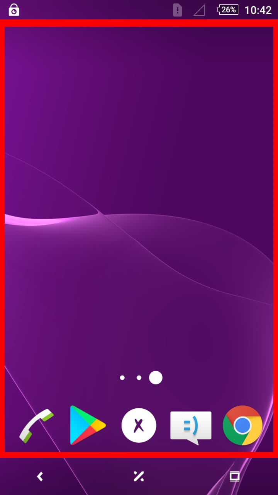
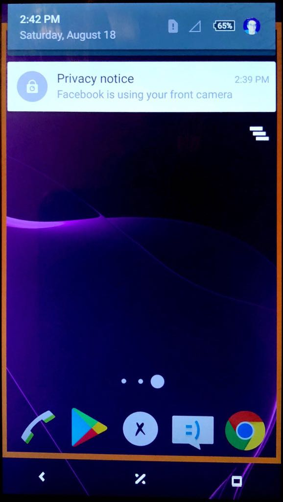

# Privacy Nudge - Frame

For research purposes (my bachelor thesis), we wanted to investigate users' feelings and reaction regarding Apps that use front-facing camera. I designed 3 different mock-up feedback tools to inform/notify users that their front camera is accessed in real time.

This tool is about showing a frame all around the screen alongside normal notification in the notification tray when front camera is accessed. I differentiated between accessing the camera and processing taken photos by changing the frame color.  

## Screenshots

